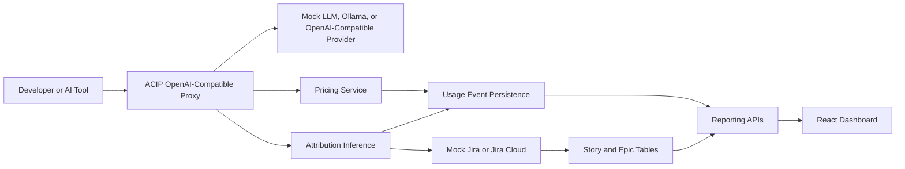
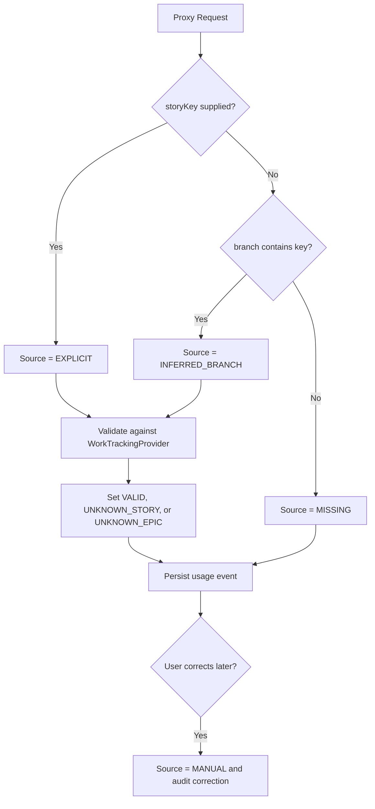

# ACIP Architecture

ACIP captures AI usage, estimates cost, attaches business context, and reports spend by team, story, epic, attribution quality, and potential waste.

## Runtime Components

- **Proxy API** accepts OpenAI-compatible chat completion requests wrapped with ACIP attribution metadata.
- **Attribution inference** prefers explicit story keys, then parses branch names for Jira-style keys, then records missing attribution without blocking usage.
- **Work tracking provider** validates stories and epics through Mock Jira locally or Jira Cloud when configured.
- **Pricing service** calculates estimated cost from provider/model pricing and token usage.
- **Reporting APIs** aggregate spend, attribution coverage, potential waste, and request detail.
- **Dashboard** gives operators a product-style view of allocation, attribution health, waste, and manual correction.

## Attribution Flow

Manual correction always wins after capture. Attribution failures are visibility signals only; ACIP does not block AI usage in the current product scope.

## Local Modes

- **Mock mode** runs PostgreSQL, ACIP API, React dashboard, and the mock OpenAI-compatible LLM.
- **Ollama mode** runs the same ACIP API against Ollama's OpenAI-compatible endpoint on port `8081`.
- **Jira mode** uses the same work tracking abstraction with Jira Cloud credentials supplied through environment variables or local secrets.
